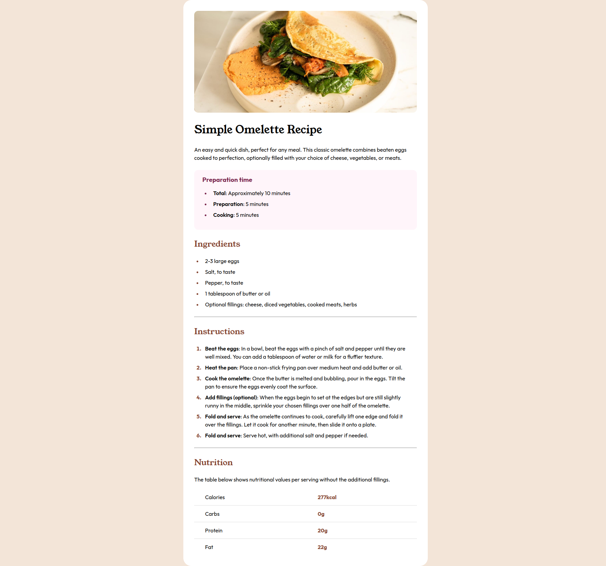

# Frontend Mentor - Recipe page solution

This is a solution to the [Recipe page challenge on Frontend Mentor](https://www.frontendmentor.io/challenges/recipe-page-KiTsR8QQKm). Frontend Mentor challenges help you improve your coding skills by building realistic projects. 

### Screenshot

### Links

- Solution URL: [github](https://github.com/mostafa-hsh/Recipe-page)
- Live Site URL: [github pages](https://mostafa-hsh.github.io/Recipe-page/)

### Built with

- Flexbox

### What I learned

styling lists and table was a little bit challenging at first but pleasant.

## Author

- Frontend Mentor - [@mostafa-hsh](https://www.frontendmentor.io/profile/mostafa-hsh)
thanks FRONTEND-MENTOR